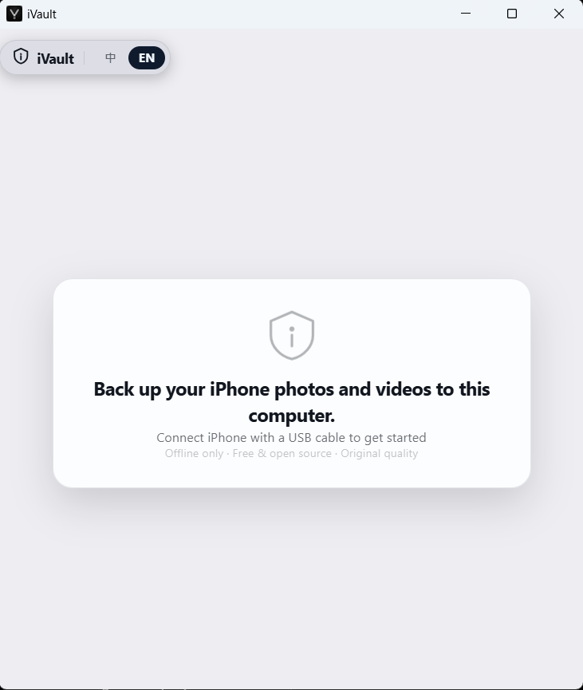
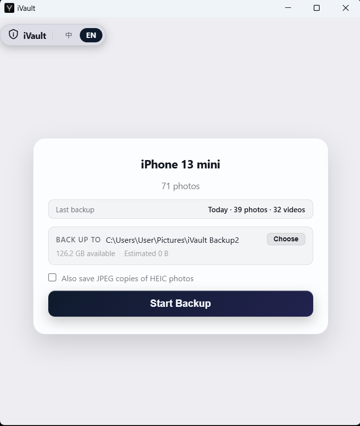
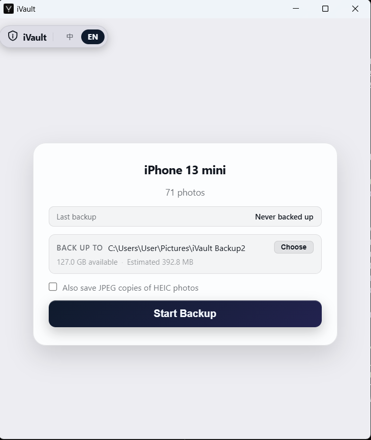
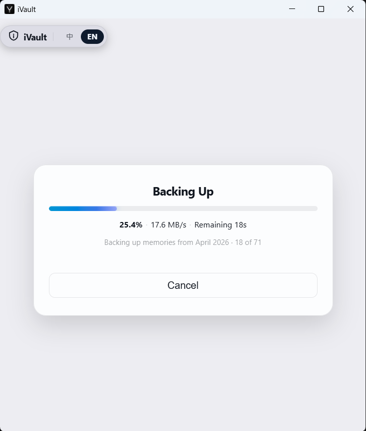

# iVault

> Back up your iPhone photos over USB — fast, free, and open source.

[繁體中文](README.zh-TW.md) | **English**


iVault transfers photos directly from your iPhone via the Apple AFC protocol — no iTunes, no iCloud, no subscription.

## Features

- Direct USB transfer via AFC protocol — no iTunes backup process
- Auto monthly folder sorting by EXIF shoot date
- Resume interrupted backups
- macOS & Windows native UI (Wails + WebView2)

## Screenshots

<table>
  <tr>
    <td align="center"><br/><sub>First launch</sub></td>
    <td align="center"><br/><sub>Returning user</sub></td>
  </tr>
  <tr>
    <td align="center"><br/><sub>Device ready</sub></td>
    <td align="center"><br/><sub>Backing up</sub></td>
  </tr>
</table>

**[→ Download & user guide (website)](https://diablofong.github.io/iVault)**

---

## Building from Source

### Prerequisites

- [Go 1.23+](https://golang.org/dl/)
- [Wails v2](https://wails.io/docs/gettingstarted/installation)
- **macOS**: Xcode Command Line Tools (`xcode-select --install`)
- **Windows**:
  - WebView2 (built into Windows 11; Windows 10 requires separate install)
  - C compiler: [TDM-GCC](https://jmeubank.github.io/tdm-gcc/) or [MSYS2](https://www.msys2.org/)

### Steps

```bash
git clone https://github.com/diablofong/iVault.git
cd iVault

# Install Go dependencies
go mod tidy

# Development mode (with hot-reload)
wails dev

# Production build
wails build
```

## Architecture

```
Go + Wails v2 (UI shell)
├── go-ios        → iPhone USB communication (AFC protocol)
├── goheif        → HEIC thumbnail processing
├── goexif        → EXIF shoot-date extraction for monthly folder sorting
└── Wails Events  → WebSocket real-time progress (server push)
```

## Reporting Issues

Found a bug or have a feature request? Please open an issue on [GitHub Issues](https://github.com/diablofong/iVault/issues).

## Contributing

Pull requests are welcome. Please open an issue first to discuss significant changes.

## License

[Apache License 2.0](LICENSE)
