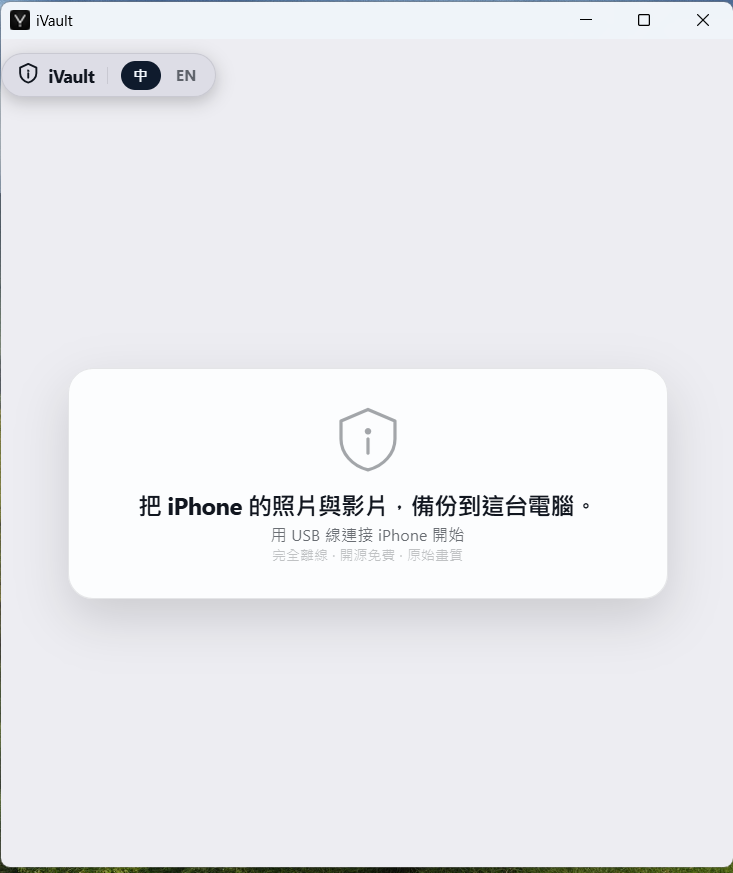
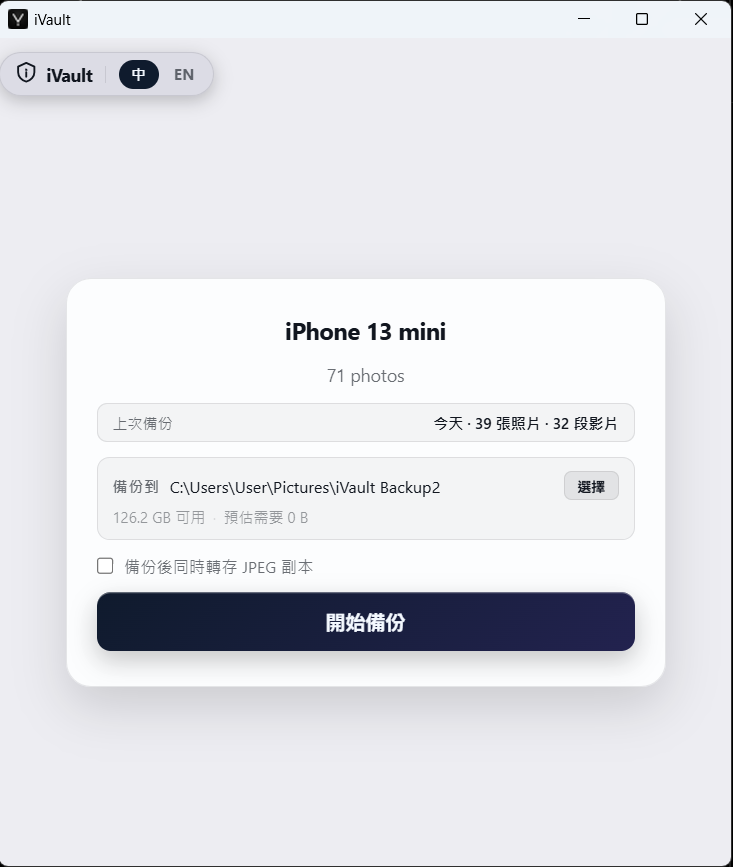
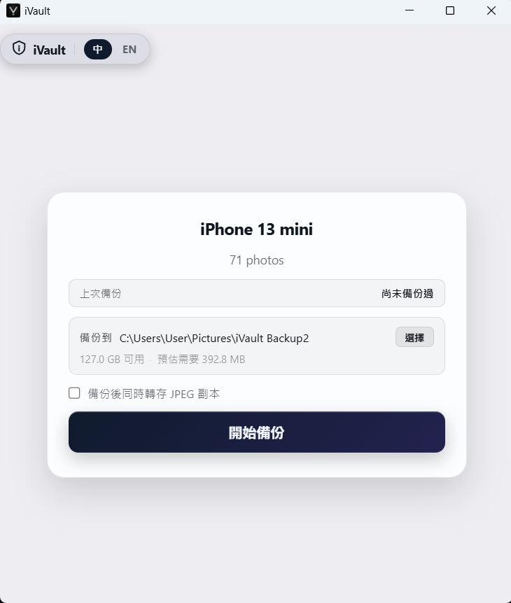
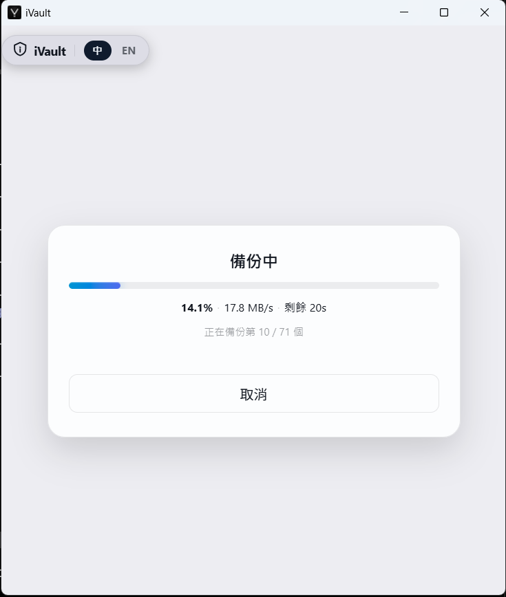
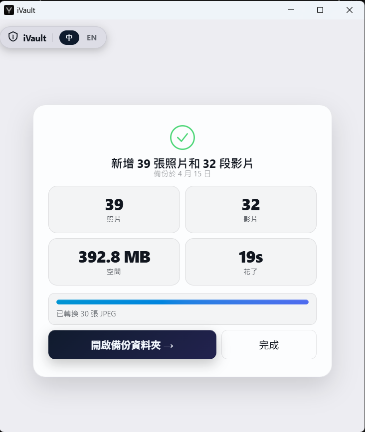

# iVault

> Windows 的免費 iPhone 照片備份工具 — USB 直傳、開源、不碰 iCloud。

**繁體中文** | [English](README.md)


因為 Microsoft Photos 老是失敗，iCloud 5GB 又不夠用。
iVault 透過 USB 直接從 iPhone 傳輸照片，無需 iCloud、無需 iTunes 同步、無訂閱費。

## 功能特色

- 透過 AFC 協定直接 USB 傳輸 — 不需雲端、不需帳號
- 依 EXIF 拍攝日期自動按月份分類
- 支援中斷後繼續備份
- Windows 原生 UI（Wails + WebView2）
- 永久免費、完全開源

## 應用程式截圖

<table>
  <tr>
    <td align="center"><br/><sub>首次啟動</sub></td>
    <td align="center"><br/><sub>再次使用</sub></td>
  </tr>
  <tr>
    <td align="center"><br/><sub>裝置就緒</sub></td>
    <td align="center"><br/><sub>備份中</sub></td>
  </tr>
  <tr>
    <td align="center"><br/><sub>備份完成</sub></td>
    <td></td>
  </tr>
</table>

**[→ 下載與使用說明（官網）](https://diablofong.github.io/iVault)**

---

## 系統需求

- Windows 10 / 11（64 位元）
- [Apple Devices App](https://apps.microsoft.com/detail/9NP83LWLPZ9K)（免費，Microsoft Store）— iPhone USB 驅動必需

## 開發者建置

### 前置需求

- [Go 1.23+](https://golang.org/dl/)
- [Wails v2](https://wails.io/docs/gettingstarted/installation)
- C 編譯器：[TDM-GCC](https://jmeubank.github.io/tdm-gcc/) 或 [MSYS2](https://www.msys2.org/)
- WebView2（Windows 11 內建，Windows 10 需另行安裝）

### 建置步驟

```bash
git clone https://github.com/diablofong/iVault.git
cd iVault

# 安裝 Go 依賴
go mod tidy

# 開發模式（含 hot-reload）
wails dev

# 正式建置
wails build -platform windows/amd64
```

## 技術架構

```
Go + Wails v2（UI Shell）
├── go-ios        → iPhone USB 通訊（AFC 協定）
├── goheif        → HEIC 格式縮圖處理
├── goexif        → 讀取 EXIF 拍攝日期，按月份自動分類
└── Wails Events  → WebSocket 即時進度推送（後端 push）
```

## 回報問題

遇到 Bug 或有功能建議？請至 [GitHub Issues](https://github.com/diablofong/iVault/issues) 開票。

## 貢獻

歡迎提交 Pull Request。重大變更請先開 Issue 討論。

## 授權

[Apache License 2.0](LICENSE)
